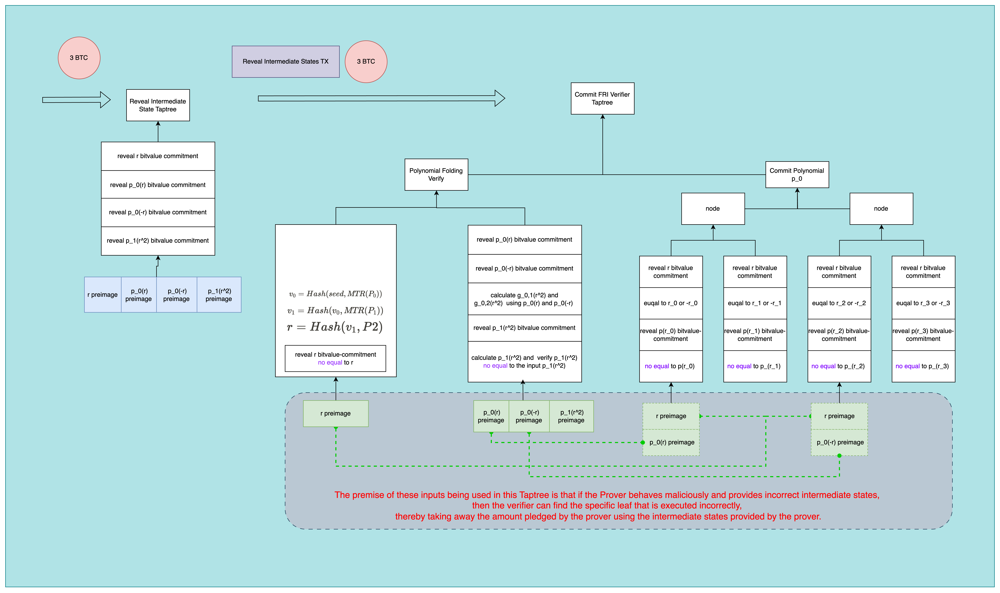

# Bitcoin Friendly FRI

[@BitlayerLabs](https://twitter.com/BitlayerLabs)

# 1. Motivation

In the latest Challenge Game of Bitvm [https://bitvm.org/bitvm2.html](https://bitvm.org/bitvm2.html), the Prover reveals all states' preimages on the chain. The Verifier, on the other hand, obtains the Prover's staked amount by proving that the states revealed by the Prover would cause the corresponding gates to execute incorrectly.


However, the issue here is that the Prover needs to reveal all states on the chain, which can be costly if the computation complexity is high. Even if we pack each leaf script with 300kb, there are still many intermediate states. After all, for verifying Groth16, operations on the elliptic curve and Pairing calculations are quite expensive. For verifying Stark, we need to verify an excessive number of MerklePaths, which would make our verification program large and thus cause too many intermediate states.

Currently, due to the lack of OP_CAT, it is actually impossible to verify the MerkleTree Path on Bitcoin.

In this article, we propose an interesting method to eliminate the verification work of Merkle Path:

During the upgrade process of Bitcoin's Taproot, the concept of Taptree was introduced. We can replace MerkleTree with Taptree, that is, commit all evaluations corresponding to the committed polynomial in the Leaf Script of Taptree. In this way, we can avoid simulating the verification process of MerklePath on the chain using Bitcoin Script.

Before that, let's review the complete process of Non-interactive FRI:

## 1.1 Complete non-interactive FRI  Process

### Commit Phase

If we want to commit polynomial P(X) with Degree of 3, a complete FRI (Field: BabyBear) process is as follows:

```jsx
impl TwoAdicField for BabyBear {
    const TWO_ADICITY: usize = 27;

    fn two_adic_generator(bits: usize) -> Self {
        assert!(bits <= Self::TWO_ADICITY);
        match bits {
            0 => Self::one(),
            1 => Self::from_canonical_u32(0x78000000),
            2 => Self::from_canonical_u32(0x67055c21),
            3 => Self::from_canonical_u32(0x5ee99486),
            4 => Self::from_canonical_u32(0xbb4c4e4),
            5 => Self::from_canonical_u32(0x2d4cc4da),
            6 => Self::from_canonical_u32(0x669d6090),
            7 => Self::from_canonical_u32(0x17b56c64),
            8 => Self::from_canonical_u32(0x67456167),
            9 => Self::from_canonical_u32(0x688442f9),
            10 => Self::from_canonical_u32(0x145e952d),
            11 => Self::from_canonical_u32(0x4fe61226),
            12 => Self::from_canonical_u32(0x4c734715),
            13 => Self::from_canonical_u32(0x11c33e2a),
            14 => Self::from_canonical_u32(0x62c3d2b1),
            15 => Self::from_canonical_u32(0x77cad399),
            16 => Self::from_canonical_u32(0x54c131f4),
            17 => Self::from_canonical_u32(0x4cabd6a6),
            18 => Self::from_canonical_u32(0x5cf5713f),
            19 => Self::from_canonical_u32(0x3e9430e8),
            20 => Self::from_canonical_u32(0xba067a3),
            21 => Self::from_canonical_u32(0x18adc27d),
            22 => Self::from_canonical_u32(0x21fd55bc),
            23 => Self::from_canonical_u32(0x4b859b3d),
            24 => Self::from_canonical_u32(0x3bd57996),
            25 => Self::from_canonical_u32(0x4483d85a),
            26 => Self::from_canonical_u32(0x3a26eef8),
            27 => Self::from_canonical_u32(0x1a427a41),
            _ => unreachable!("Already asserted that bits <= Self::TWO_ADICITY"),
        }
    }
}
```

1. For $P_0(X) = P(X)$ with the order of 3, its Evaluation From has four points. We can choose the following code as FRI to generate a 4th-root-of-unity. Then we use four Merkle Tree leaf nodes to commit $P_0(0xbb4c4e4), P_0(0xbb4c4e4^2), P_0(0xbb4c4e4^3), P_0(0xbb4c4e4^4)$. At the same time, the Prover can calculate the Root of this Merkletree as $MTR(P_0)$.
2. The Prover calculates a random number $v_0$ to fold $P_0(X)$
    1. Calculate $v_0$:
        1. $v_0 = Hash(seed,MTR(P_0))$
    2. Fold $P_0(X)$
        1. $P_0(X) = g_{0,1}(X^2) + Xg_{0,2}(X^2)$
        2. $P_1(X) = g_{0,1}(X) + v_0g_{0,2}(X)$
        3. e.g. $P_0 = 1 + X + X^2 + X^3 = 1+X^2 + X(1+X^2)$
        4. e.g. $P_1 = 1+X^2 + v_0 (1+X^2)$ and at this point set $X = X^2$ , we can get $P_1 = 1+X + v_0 (1+X)$
    3. According to the above process, the original $P_0(X)$ can be reduced by a random number $v_0$ to half its order to 1, yielding $P_1(X)$.
3. The prover continues to commit $P_1(X)$. Because the order of $P_1(X)$ is now 1, its evaluation form only has two points, so we only need to construct a MerkleTree with two leaf nodes to commit it, and obtain the corresponding $MTR(P_1(X))$.
4. The Prover calculates a random number $v_1$ for folding $P_1(X)$:
    1. $v_1 = Hash(v_0,MTR(P_1))$
    2. folding  $P_1(X)$
        1. $P_1(X) = g_{0,1}(X^2) + Xg_{0,2}(X^2)$
    3. $P_2(X) = g_{1,1}(X) + v_1g_{1,2}(X)$
    4. e.g. $P_1 = 1+X + v_0 (1+X) = 1+v_0 +X(1+v_0)$
    5. e.g. $P_2 = 1+X + v_0 (1+X) = 1+v_0 +v_1(1+v_0)$  Here, we have already obtained a constant value, so the entire FRI Commit process is now complete.

### Query Phase

- The Prover and Verifier generate a query position for the polynomial based on the same Hash Chain
    - Position $r = Hash( v_1 ,P2)$
    - The Prover provides the corresponding values $P_0(r),P_0(-r),P_1(r^2),P_1(-r^2),P2$
    - The Prover provides the corresponding MerklePath: $MTP(P_0(r)),MTP(P_0(-r)),MTP(P_1(r^2)),MTP(P_1(-r^2))$
    
    ```jsx
    Proof {
    	Final Result: P2
    	evaluation: P_0(r),P_0(-r),P_1(r^2),P_1(-r^2),P2
    	MerklePath: MTP(P_0(r)),MTP(P_0(-r)),MTP(P_1(r^2)),MTP(P_1(-r^2))
    }
    ```
    
1. At this time, the Prover gives out an FRI Proof
    - Position $r = Hash( v_1 ,P2)$
    - Prover provides the corresponding value $P_0(r),P_0(-r),P_1(r^2),P_1(-r^2),P2$
    - Prover provides the corresponding MerklePath:$MTP(P_0(r)),MTP(P_0(-r)),MTP(P_1(r^2)),MTP(P_1(-r^2))$
2. Verifier verification Proof
    1. Verify according to $p_0(r)$ and $p_0(-r)$ calculate $p_1(r^2)$
       
        $p_0(r) = g_{0,1}(r^2 ) + r · g_{0,2}(r^2 )$,
        
        $p_0(−r) = g_{0,1}(r^2 ) − r · g_{0,2}(r^2 )$*,*
        
        The Verifier can calculate $g_{0,1}(r^2)$ through $p_0(r) + p_0(-r)$, and calculate $g_{0,2}(r^2)$ through $p_0(r) - p_0(-r)$. Then, the Verifier can calculate $p_1(r^2 ) = g_{0,1}(r^2 ) + v_0 · g_{0,2}(r^2 )$ by itself.
        
    2. The Verifier compares the $p_1(r^2)$ calculated by itself with the $p_1(r^2)$ provided in the Prover's proof.
        1. $p_1(r^2) == p_1(r^2)$
    3. Continue to calculate the value of $p_2$ based on $p_1(r^2)$ and $p_1(-r^2)$, and compare it with the value of $p_2$ provided by Prover.
       
        $*p_1(r^2 ) = g_{0,1}(r^2 ) + v_0 · g_{0,2}(r^2 ).*$
        
    4. At the same time, when the Verifier verifies the correctness of the folding relationship between values, it also verifies the MerklePath of the corresponding values.

## 2. Replace Merkletree with Taptree

If we want to replace MerkleTree with Taptree, it's clear that we can't directly put the corresponding values in the Leaf Script of Taptree, because in this way, it can't connect with the other parts of FRI verification, so we need to change the value type of the leaf nodes.

The following image is an example of changing the MerkleTree Commitment of the $p_0$ polynomial to a Taptree Commitment. In other words, we not only store the evaluation itself and the bit value commitment of the evaluation, but we also need to put the value of the x-coordinate and its corresponding bit value commitment into it.


The composition of each Leaf Script:

- reveal r bitvalue commitment ：
    - This part of the script is actually to link up with FRI to verify the correctness of polynomial folding script. In that script, we will calculate the x-coordinate r of the points to be randomly challenged. We need to use bitvalue commitment to ensure that we can pass the r value used by the verification script to this Commit Taptree.。
- equal to $r_0$ or $-r_0$:
    - Because we can't know which node we are in Taptree in Leaf Script, we also need to commit the corresponding abscissa in the form of a bitvalue commitment in the Script. This part is mainly because we use the same bit value commitment for our abscissa r, so we need to judge whether the value revealed by the preimage is equal to r_0 or -r_0, because the Prover can't reveal the preimage of -r, which would be equivocation.
- reveal $p(r_0)$ bitvalue commitment:
    - Each polynomial evaluation corresponding to different abscissas has its own independent bit value commitment.
- equal to $p(r_i):$ Promise the value of the p polynomial at the abscissa r_i, and judge whether the value of the p(r_i) bitvalue commitment revealed by preimage is equal to the promised value of p(r_i).

Combine the verification program with the $p_0$ evaluation Taptree Commitment:

1. The first step is to construct a Hash Chain similar to Prover and calculate the x-coordinate value to be challenged for the $p_0$ polynomial
2. The second step is to calculate $g_{0,1}(r^2)$ through $p_0(r) + p_0(-r)$, calculate $g_{0,2}(r^2)$ through $p_0(r) - p_0(-r)$, then Verifier can calculate $p_1(r^2 ) = g_{0,1}(r^2 ) + v_0 · g_{0,2}(r^2 )$ on its own and then compare the calculated $p_1(r^2)$ with the $p_1(r^2)$ provided in Prover's proof.
3. $p_1(r^2) == p_1(r^2)$

> *In the following diagram, the execution order of each leaf node's Script is from top to bottom, where the blue rectangle represents the input, and the blue dotted line represents that if these two values are not consistent, verifier can take away the staked amount by proving equivocation.*
> 


Currently, the unlock condition is that the provided input can execute the Gate correctly. The Prover also needs to unlock the leaf script to prove it is correct, which will lead to additional costs.

So we will use the method of bitvm2 to change all Leaf Scripts to No Equal, and the prover only need to provide the intermediate states. The modified diagram is shown below:

> *In the following diagram, the execution order of each leaf node's Script is from top to bottom, where the blue rectangle represents the input, and the green dotted line represents that if these two values are not consistent, verifier can take away the staked amount by proving equivocation.*
> 



Prover will first provide all intermediate states through a transaction called Reveal Intermediate States TX to unlock the Reveal Intermediate State Taptree, and then transfer 3BTC to the Commit FRI Verifier Taptree. At this point, if the verifier finds any problem with the state provided by the prover, it can unlock a specific erroneous leaf node by using the intermediate state as input.

In the Polynomial Folding Verify of the first leaf node in the Commit FRI Verifier Taptree, the value of the polynomial to be sampled at point r will be calculated. In the second leaf node, the corresponding polynomial $p_0$ at points r and -r, and $p_1(r^2)$ will be used to calculate the correctness of the polynomial folding. They seem to have no correlation, but in fact, because the abscissa r used by the bit value commitment is already included in the leaf node of Commit Polynomial $p_0$, and the corresponding values $p(r_0)$ and $p(-r_0)$ at different abscissas have been committed to Commit Polynomial $p_0$ with the corresponding abscissas r and -r. If the prover does not use the correct values of $p(r_0)$ and $p(-r_0)$, then the verifier has the ability to unlock the corresponding leaf node of Commit Polynomial $p_0$ by providing the corresponding r and erroneous $p_0(r)$.

We need to note that each random sampling of each polynomial requires a new Taptree, because the bit value commitment of the abscissa cannot be used twice. Moreover, the above diagram actually omits the Taptree commitment of all evaluation points of the $p_1$ polynomial, as well as the Taptree for all bit value commitment equivocations.

## 3. Future Work

We need to conduct a comprehensive security analysis of Bitcoin Friendly FRI.


## Reference

https://eprint.iacr.org/2023/474

https://eprint.iacr.org/2021/582

https://bitvm.org/bitvm2.html