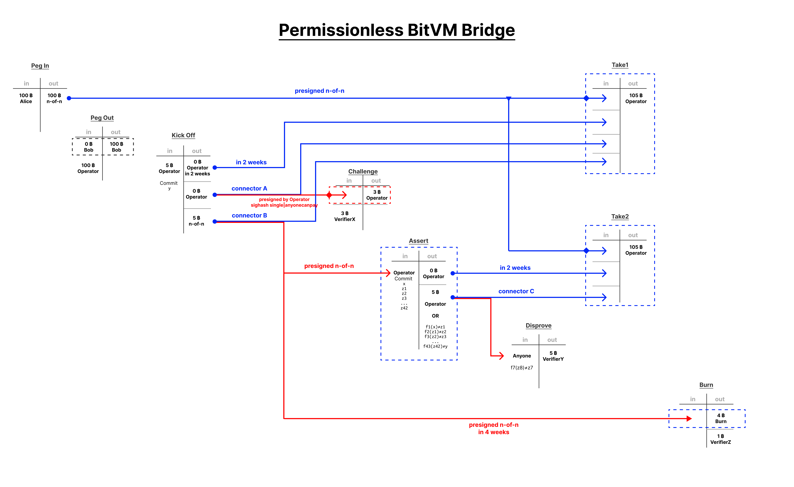

# BitVM 2: Permissionless Verification on Bitcoin

The original BitVM design was limited to the two-party setting. Further works combined parallel and redundant instances to introduce multi-party configurations based on 1-of-n honesty assumptions. Major limitation of these contracts was that all verifiers had to be defined during compile time. Furthermore, the setup cost increased with the number of verifiers. This implied there was always a limited number of parties that one would have to bribe to break a contract.

BitVM 2 is a novel variant in which anyone can act as verifier. This still requires a one-time setup with a 1-of-n honesty assumption, but during runtime anyone can challenge an invalid assertion without having to be part of the initial group of n. This overcomes limitations of previous schemes and improves on their trust assumptions. Furthermore, it simplifies the overall design and reduces the maximum length of the trial down to two rounds.

Bridges still additionally require some predefined set of `m` operators and at least one of them has to act honest. However, even in case of all operators being dishonest, they cannot steal any deposit but only burn them at worst. 

## Introduction
For a given program `f` we want to verify that for some input `x` and output `y` the assertion `f(x) = y` holds. For example, `f` could be a [SNARK verifier](https://bitvm.org/snark), e.g., for the Groth16 proof system. Then `x` would be a proof and `y` is some output state for which the SNARK proves validity.

In case of a SNARK verifier the program is too large to represent it in a single Bitcoin Script. Implementing a Groth16 verifier would maybe result in a 20mb Script. However, the maximum script size is Bitcoin's block size of 4mb. And even that size would likely be impractically large.

## Naive Solution

Lamport signatures offer a way to split up a program `f(x)=y` into multiple steps. For the case `n=42` steps:
```
f1(x)  = z1
f2(z1) = z2
f3(z2) = z3
...
f42(z41) = z42
f43(z42) = y
```

such that the computation of `f` can be spread out over a sequence of 43 transactions executed over multiple blocks. Each transaction takes as input state the output state of the previous transaction. If the prover equivocates on any of the states `z_i` then everyone can use the conflicting Lamport signatures as a fraud proof.

This approach offers a permissionless way to challenge the prover. However, major limitation of this solution is its heavy onchain footprint as it still requires the prover to execute the entire computation. Additionally, it introduces the overhead of transitioning state via Lamport signatures.

## Balanced Solution

We can significantly reduce the onchain footprint by shifting some of the heavy work from the prover into the verifier's fraud proof. Now the prover merely commits to `x`, `y`, and all intermediate results `z1, z2, ... , z42` at once. 

Any verifier can disprove any faulty assertion. During setup we define a single Taptree containing 43 scripts to disprove any of the computations of `f1, f2, f3, ..., f43`. Anyone can spend from any of these scripts exactly if an assertion 

```
f_i( z_(i-1) ) == z_i
``` 

doesn't hold. This reduces the total worst-case computation to a single step `f_i`, executed by the verifier. That step might still require a sizeable Script implementation. Theoretically, that's fine as long as it fits into a single block, or even better, the standardness size of 400kb. In practice, for some specific implementation of `f`, we would try to find an optimal balance between the prover's commitment size and the verifier's Script size.

Effectively, this allows anyone to destroy the prover's output if they make any incorrect assertion. Otherwise, if nobody disproves any part of the computation, then the script times out and lets the honest prover spend the output. 
That's at most two rounds in total.

This mechanism can act as elementary building block for permissionless bridge verification.


## Optimistic Solution 

The following protocol improves the happy path (which is hopefully the most common path) of the above design at the expense of introducing two more rounds of interaction for the worst case: 

1. Prover commits to output state `y`
2. If incorrect, anyone can start a challenge
3. Prover commits to intermediate results `z1, z2, ... z42`
4. If incorrect, anyone can disprove assertion `f_i`


## Permissionless Bridge Design


(Zoom in: Right click -> open in new tab)


### Limitation: Fees
In the design above, a prover can steal some fees. In this scenario, the deposit is still safe, but the verifier lost their collateral.

The attack scenario is as follows:
- the prover is malicious
- prover executes their KickOff_Tx without a valid PegOut_Tx
- prover waits for a challenger to execute the Challenge_TX paying the prover to execute the challenge
- prover doesn't execute the challenge but simply stops responding

The following modification of the graph fixes the fee issue. It requires two more n-of-n presigned transactions.




### Limitation: Honest Operator
The design requires at least one honest operator, otherwise the funds get burned. In practice liveness failures can be used to steal funds with a ransom attack. (E.g. I will only unfreeze your funds if you pay me a 50% ransom.)
