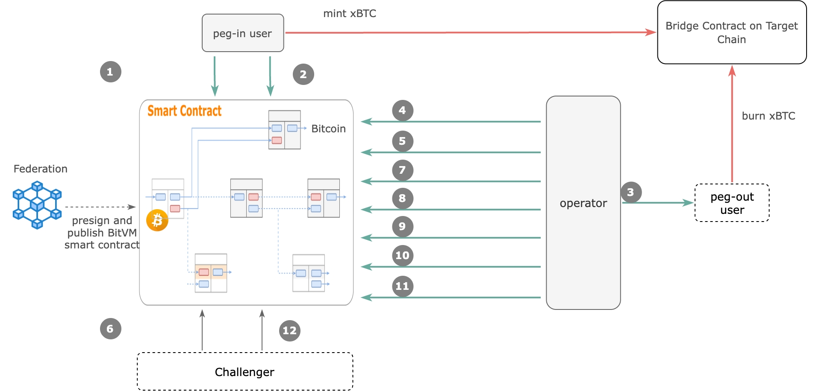

# BitVM Developer Preview

This demo showcases the latest progress of the [BitVM project](https://bitvm.org/).

It presents the first real-world use case of BitVM: the complete protocol process [BitVM Bridge](https://bitvm.org/bitvm_bridge.pdf). 

This demo marks a significant milestone for the BitVM project as it moves toward the next critical stage: a code audit of the foundational library.

# Signet Transactions

A public signet([bitvmnet](https://docs.bitlayer.org/docs/BitVMBridge/BitVMNet)) is set up for the BitVM development and testing. 
 
People can check the transactions in public signet [explorer](https://mempool.bitvmnet.org/).

## Transaction Graph

 <a
   target="_blank"
   rel="noreferrer"
   class="step-link"
   href="https://mempool.bitvmnet.org/tx/4dd5d195073af820875b5f19dc2ab30862798af2ea63fc37aecbe1051f1e8688"
   style="left: 150px; top: 75px"
   >Peg in deposit</a
 >
 <a
   target="_blank"
   rel="noreferrer"
   class="step-link"
   href="https://mempool.bitvmnet.org/tx/e9663b684cb15f255ef0a77fdcc5ffebcfa0ba06dc32b4650b3fab8d91da518f"
   style="left: 375px; top: 75px"
   >Peg in confirm</a
 >
 <a
   target="_blank"
   rel="noreferrer"
   class="step-link"
href="https://mempool.bitvmnet.org/tx/095c21cc45331da7fdb45f8f56e184c4d983cf86f539fd32ee39cc44543e71bd"    style="left: 750px; top: 200px; width: 50px; text-align: center"
   >Peg out (front)</a
 >
 <a
   target="_blank"
   rel="noreferrer"
   class="step-link"
href="https://mempool.bitvmnet.org/tx/1c74c2819717b3af854c2ab50b58001186e40f384fb8c1bd01791fce64cc7353"        style="left: 490px; top: 120px"
   >Peg out confirm</a
 >
 <a
   target="_blank"
   rel="noreferrer"
   class="step-link"
href="https://mempool.bitvmnet.org/tx/8d96aab47ef67279141ae0eeccf1b588ab9ad1d75fba1a6dd46a70845499006e"      style="left: 490px; top: 155px"
   >Kickoff1</a
 >
 <a
   target="_blank"
   rel="noreferrer"
   class="step-link"
   href="#"
   style="left: 150px; top: 376px"
   >Challenge</a
 >
 <a
   target="_blank"
   rel="noreferrer"
   class="step-link"
href="https://mempool.bitvmnet.org/tx/3c8d81f37e28f64b34a76e41b58788c94e1a7e7a0761c2d5a235aa956908243a"          style="left: 490px; top: 190px"
   >Kickoff2</a
 >
 <a
   target="_blank"
   rel="noreferrer"
   class="step-link"
href="https://mempool.bitvmnet.org/tx/8d386719cc3bc461e07c261a14419fd87b8e56374283b79e357b05b9fb3fd45c"     style="left: 490px; top: 222px"
   >Assert initial</a
 >
 <a
   target="_blank"
   rel="noreferrer"
   class="step-link"
href="https://mempool.bitvmnet.org/tx/bb29da2a87879faf46c22fbb19a3961b226c4a6075bad5226a6802472fbb0871"      style="left: 490px; top: 254px"
   >Assert commit1</a
 >
 <a
   target="_blank"
   rel="noreferrer"
   class="step-link"
href="https://mempool.bitvmnet.org/tx/93e951de5ce6335f588f344ff58d54e1d813fcecc192a186bf7e19d712556680"        style="left: 490px; top: 288px"
   >Assert commit2</a
 >
 <a
   target="_blank"
   rel="noreferrer"
   class="step-link"
href="https://mempool.bitvmnet.org/tx/e7da86777532342521f80bbf2bfc477ebbab289866b6c2842673a006ec34512a"      style="left: 490px; top: 323px"
   >Assert final</a
 >
 <a
   target="_blank"
   rel="noreferrer"
   class="step-link"
href="https://mempool.bitvmnet.org/tx/ee29855315760b5b839ad20c9ce19a1e235c54afc2431b2a527b97458c0ab8e5"     style="left: 360px; top: 378px"
   >Disprove</a
 >
 

## Transaction Explanation

> Following the terms in [bitvm bridge paper](https://bitvm.org/bitvm_bridge.pdf)

###  Roles

**Alice** is a peg-in user, who wants deposit `v` BTC into a BitVM2 instance.

**Bob** is a peg-out user, who wants withdraw the `v` wrapped BTC to Bitcoin.

### Peg in
[https://mempool.bitvmnet.org/tx/4dd5d195073af820875b5f19dc2ab30862798af2ea63fc37aecbe1051f1e8688](https://mempool.bitvmnet.org/tx/4dd5d195073af820875b5f19dc2ab30862798af2ea63fc37aecbe1051f1e8688){:target="_blank"}

Alice deposits `v` BTC on Bitcoin into a BitVM2 instance via a PegIn transaction. In this stage, Alice has a chance to retreat her funds.

### Peg in confirm
[https://mempool.bitvmnet.org/tx/e9663b684cb15f255ef0a77fdcc5ffebcfa0ba06dc32b4650b3fab8d91da518f](https://mempool.bitvmnet.org/tx/e9663b684cb15f255ef0a77fdcc5ffebcfa0ba06dc32b4650b3fab8d91da518f){:target="_blank"}

Alice sends PegIn Confirm transaction to confirm the peg-in operation. The sidesystem verifies that the PegIn transaction was included in the Bitcoin blockchain and mints `v` wrapped BTC to Alice's account in the sidesystem. Alice can now freely use wrapped BTC on the sidesystem.

### Peg out
[https://mempool.bitvmnet.org/tx/095c21cc45331da7fdb45f8f56e184c4d983cf86f539fd32ee39cc44543e71bd](https://mempool.bitvmnet.org/tx/095c21cc45331da7fdb45f8f56e184c4d983cf86f539fd32ee39cc44543e71bd){:target="_blank"}

Bob wants to withdraw the `v` wrapped BTC back to Bitcion. For this, he burns the `v` wrapped BTC using a Burn transaction on the sidesystem, which makes the wrapped BTC unspendable. At this stage, one of the m operators effectively fronts the `v` wrapped BTC from their own funds. The operator compete to publish the PegOut transaction in order to claim the associated fees, and Bob get BTC from this transaction.

### Peg out confirm
[https://mempool.bitvmnet.org/tx/1c74c2819717b3af854c2ab50b58001186e40f384fb8c1bd01791fce64cc7353](https://mempool.bitvmnet.org/tx/1c74c2819717b3af854c2ab50b58001186e40f384fb8c1bd01791fce64cc7353){:target="_blank"}

The PegOut Confirm transaction will reveal related transaction IDs in both source network (SideSystem Network) and destination network (Bitcoin Network).

### Kickoff_1
[https://mempool.bitvmnet.org/tx/8d96aab47ef67279141ae0eeccf1b588ab9ad1d75fba1a6dd46a70845499006e](https://mempool.bitvmnet.org/tx/8d96aab47ef67279141ae0eeccf1b588ab9ad1d75fba1a6dd46a70845499006e){:target="_blank"}

The operator initiates a claim to recover the pre-funded amount of `v` BTC from BitVM2. This is done by publishing the Kickoff_1 transaction. This transaction opens a commitment and challenge period, during which all challengers perform this verification on their local machines and publish the challenge transaction. For the purpose of demo, the following transaction happened in the challenge path by default.

### Kickoff 2
[https://mempool.bitvmnet.org/tx/3c8d81f37e28f64b34a76e41b58788c94e1a7e7a0761c2d5a235aa956908243a](https://mempool.bitvmnet.org/tx/3c8d81f37e28f64b34a76e41b58788c94e1a7e7a0761c2d5a235aa956908243a){:target="_blank"}

The operator must publish the Kickoff_2 transaction immediately, committing to the current time TS. This time TS marks the start of a superblock measurement period that lasts for the period (e.g. 2000 blocks), during which the operator must observe all blocks on the main chain and identify the heaviest superblock SB.

### Assert initial 
[https://mempool.bitvmnet.org/tx/8d386719cc3bc461e07c261a14419fd87b8e56374283b79e357b05b9fb3fd45c](https://mempool.bitvmnet.org/tx/8d386719cc3bc461e07c261a14419fd87b8e56374283b79e357b05b9fb3fd45c){:target="_blank"}

Assert transactions are a family of transactions that reveal all the intermediate states of the SNARK verifier program. Assert Initial transaction is a preparation transaction to efficiently send asserts transaction.

### Assert Commit_1 
[https://mempool.bitvmnet.org/tx/bb29da2a87879faf46c22fbb19a3961b226c4a6075bad5226a6802472fbb0871](https://mempool.bitvmnet.org/tx/bb29da2a87879faf46c22fbb19a3961b226c4a6075bad5226a6802472fbb0871){:target="_blank"}

Assert Commit_1 transaction is the first parallel assert transaction which contains half of all the intermediate states.

### Assert Commit_2 
[https://mempool.bitvmnet.org/tx/93e951de5ce6335f588f344ff58d54e1d813fcecc192a186bf7e19d712556680](https://mempool.bitvmnet.org/tx/93e951de5ce6335f588f344ff58d54e1d813fcecc192a186bf7e19d712556680){:target="_blank"}

Assert Commit_2 transaction is the second parallel assert transaction which contains another half of all the intermediate states.

### Assert Final 
[https://mempool.bitvmnet.org/tx/e7da86777532342521f80bbf2bfc477ebbab289866b6c2842673a006ec34512a](https://mempool.bitvmnet.org/tx/e7da86777532342521f80bbf2bfc477ebbab289866b6c2842673a006ec34512a){:target="_blank"}

Assert Final is the final transaction to close all assert transactions. all the intermediate states form an execution trace of the SNARK verifier program.

### Disprove
[https://mempool.bitvmnet.org/tx/ee29855315760b5b839ad20c9ce19a1e235c54afc2431b2a527b97458c0ab8e5](https://mempool.bitvmnet.org/tx/ee29855315760b5b839ad20c9ce19a1e235c54afc2431b2a527b97458c0ab8e5){:target="_blank"}

SNARK verifier program is splited into leafs of a Taptree. The disprove transaction allows anyone to challenge a part of SNARK verifier program. This is possible if and only if the operator made an incorrect claim about one of the intermediary states. Anyone can read the commitments made by the operator from the execution trace and provide them as inputs to the script in one of the leaves.

## Reproduce Demo

Developers can use the following stuff to reproduce the processes in the local environment.

[Code base tag](https://github.com/BitVM/BitVM/releases/tag/v0.1.0-alpha)

[Instructions](https://github.com/BitVM/BitVM/blob/main/DEMO_INSTRUCTIONS.md)

## About
This page is maintained by [BitVM Alliance](https://bitvm.org/#about-bitvm-alliance)

